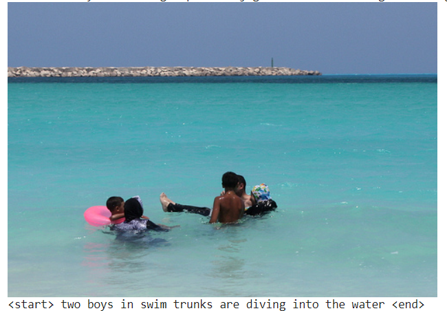
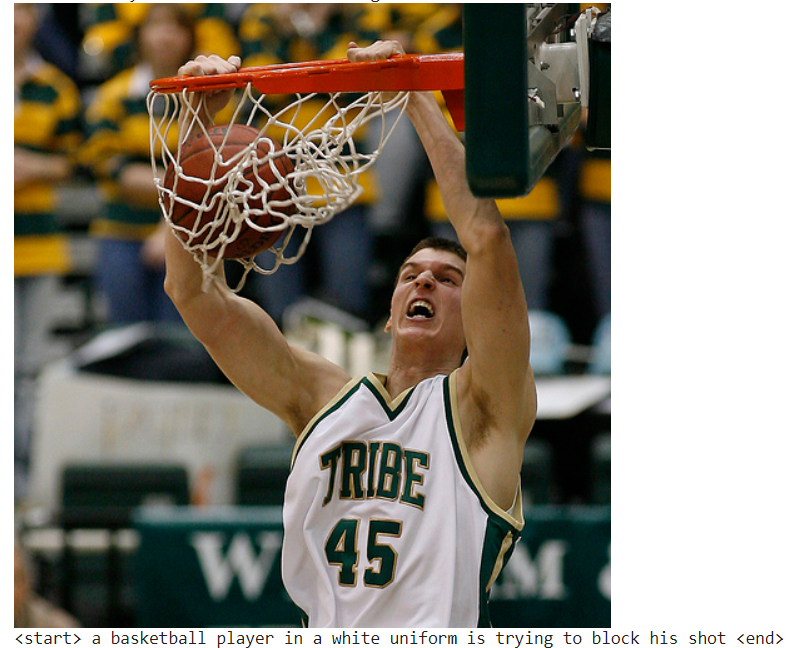
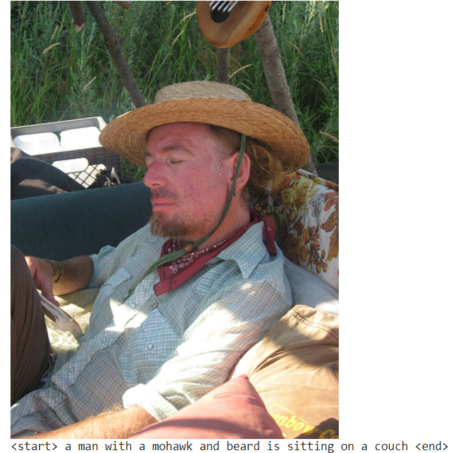
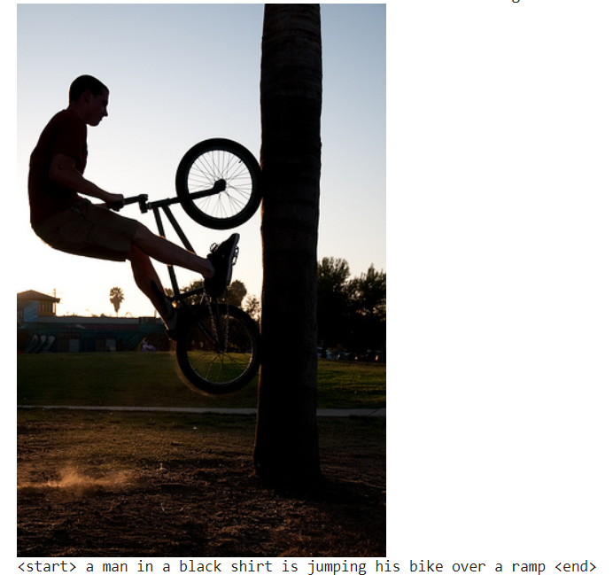
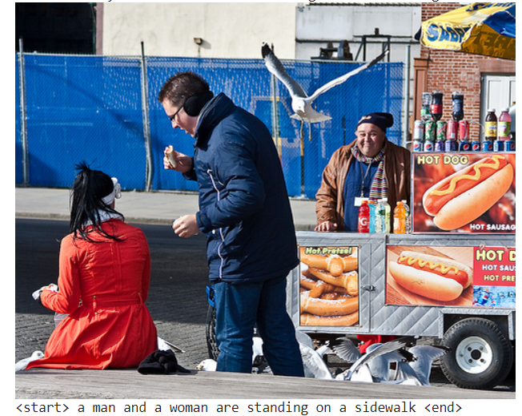
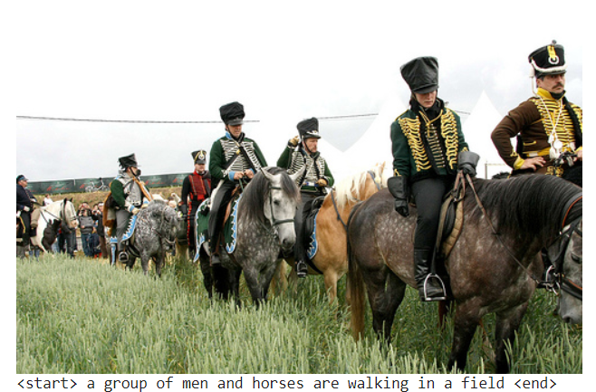
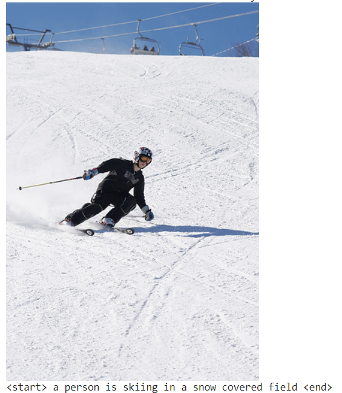
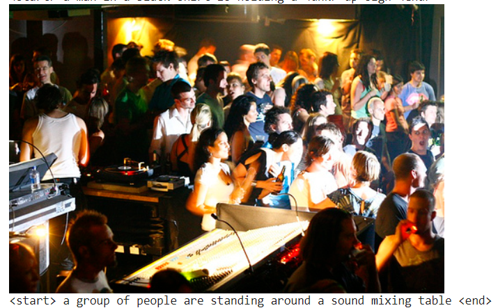

# Automatic Captioning
Automatic captioning 1-week project in the context of a Deep Learning class (Mines Nancy).

Implementation of a RNN Neural Network to generate captions on images in an unsupervised way.

Some results as explained in the notebook :

